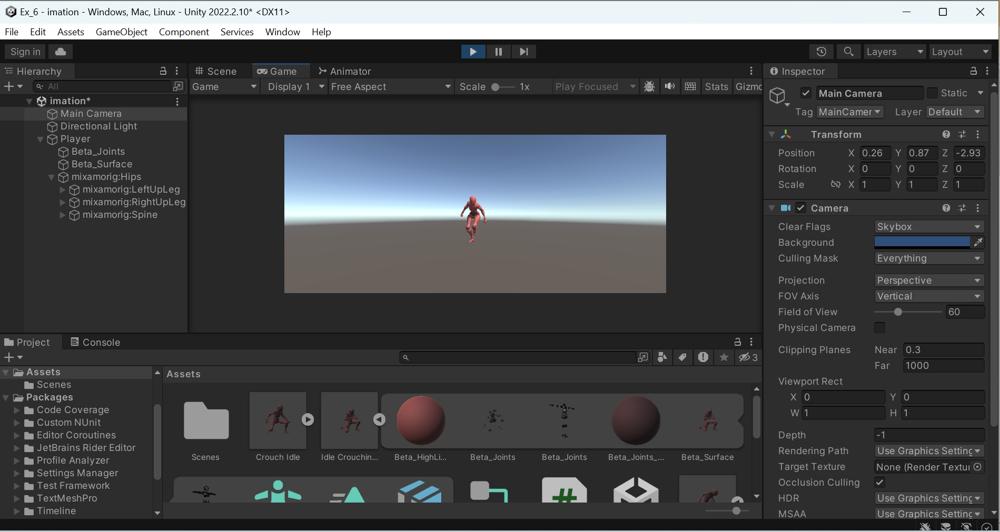
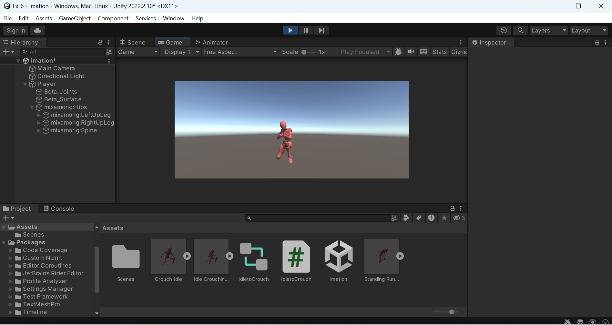

# ANIMATOR
## AIM:
To develop an animator using unity with C# program and move the animator.

## ALGORITHM:
### STEP 1:
Download 2 crouch idle from maximo 3d. Drag it and drop it in unity asset.
### STEP 2:
Select one crouch and in the inspector choose rig-> Animation type (humanoid) and then click update.
### STEP 3:
Perform the step 2 for another crouch
### STEP 4:
Select one crouch and in the inspector choose Animation-> Root transform rotation-> Based upon (original)  and check the Loop Time and click apply
### STEP 5:
Perform the step 4 for another crouch
### STEP 6:
Drag one crouch, put it in hierarchy and name it as Player.
### STEP 7:
In the Player inspector we have Animator. Right click in Assets-> create -> Animator Controller (name it as IdleToCrouch)
### STEP 8:
Drag the IdleToCrouch to the Controller option under the Animator in the inspector. Click that IdleToCrouch , a window opens and select parameter tab , create 2 parameter, InputX and InputY
### STEP 9:
Select another crouch and attach with Entry button and name it as movement. Right click it and choose create blend tree.
### STEP 10:
Click the movement button, blend tree opens. Choose InputY in parameter and under the motion click ‘+’ sign and choose add the motion field twice.
### STEP 11:
Drag the second crouch and put it motion field, then drag the first crouch and put it in another motion field.
### STEP 12:
Uncheck the automata threshold and change the values -1 and 0 in first column( priority for the crouch). Create a C# file and name it as IdleToCrouch, drag it to the player
### STEP 13:
Download a walking crouch from maximo 3d and drag it into unity. In the inspector select rig-> animation types(humanoid) -> Apply
### STEP 14:
Select the crouch and in the inspector choose Animation-> Root transform rotation-> Based upon (original)  and check the Loop Time and click apply
### STEP 15:
In blend tree, in blend type choose (2D Freedom Directional), parameter (InputX, InputY) , one crouch (0,-1,1) and walking (1,0,1). Bring the camera under the player 

## PROGRAM:
```
NAME : PAARKAVY B
REG NO : 212221230072
```

```
using System.Collections;
using System.Collections.Generic;
using UnityEngine;

public class IdletoCrouch : MonoBehaviour
{
    public Animator animator;
    public float InputX;
    public float InputY;
    // Start is called before the first frame update
    void Start()
    {
        animator = this.gameObject.GetComponent<Animator>();
    }

    // Update is called once per frame
    void Update()
    {
        InputX = Input.GetAxis("Vertical");
        InputY = Input.GetAxis("Horizontal");
        animator.SetFloat("InputX", InputX);
        animator.SetFloat("InputY", InputY);
    }
}

```

## OUTPUT:




## RESULT:
Thus, the animator was successfully developed in unity engine with the C#.